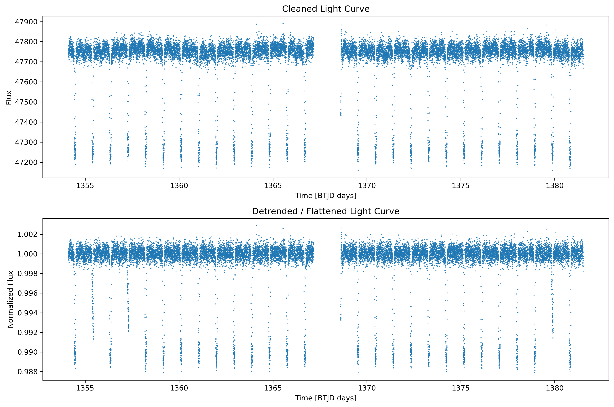

# Detecting Exoplanet Transits Using Photometric Light Curve Analysis

## Overview
This project was developed as part of an undergraduate physics graduation project. The objective is to detect exoplanet transit events through the analysis of photometric light curve data using Python-based data analysis techniques.

Exoplanet transits occur when a planet passes in front of its host star, causing a small and measurable decrease in the observed stellar brightness. By analyzing these variations, it is possible to identify potential exoplanet candidates and estimate key transit parameters.

## Objectives
- Process and clean photometric light curve data.
- Visualize stellar brightness variations over time.
- Identify transit-like signals in observational data.
- Analyze transit characteristics using numerical methods.
- Demonstrate the application of data science techniques in astrophysical research.

## Methodology
The analysis workflow consists of:

1. Importing and preprocessing photometric observations.
2. Removing noise and invalid measurements.
3. Generating light curve visualizations.
4. Detecting brightness dips associated with transit events.
5. Evaluating transit depth and duration.
6. Interpreting the results within the context of exoplanet detection.

## Data Source
The photometric light curve data used in this project were obtained from NASA's Transiting Exoplanet Survey Satellite (TESS) mission through the Lightkurve Python package. The target analyzed in this study is WASP-18, a well-known exoplanet host star. The TESS observations provide high-precision brightness measurements that enable the detection and characterization of exoplanet transit events.

Data access was performed using the Lightkurve package, which retrieves observations from the Mikulski Archive for Space Telescopes (MAST).

## Tools and Libraries
- Python
- NumPy
- Matplotlib
- SciPy
- Astropy
- Lightkurve
- BATMAN
- Jupyter Notebook

## Repository Structure
.
├── Exoplanet_Transit_Detection.ipynb
├── README.md
└── figures/
    ├── light_curve.png
    ├── transit_detection.png
    └── results.png

## Results
The analysis successfully demonstrates how photometric light curve observations can be used to identify potential exoplanet transit signatures. The generated visualizations highlight characteristic brightness reductions associated with planetary transits and provide insight into observational exoplanet research techniques.
### Cleaned and Detrended Light Curve

### Transit Detection

## Academic Context
This repository accompanies an undergraduate physics graduation project focused on astronomical data analysis and exoplanet detection techniques. It serves as a demonstration of practical experience in scientific computing, data analysis, and astrophysical research.

## Author
Wesam Alaqra

Department of Physics, Al al-Bayt University, Jordan

Graduation Project – 2026
